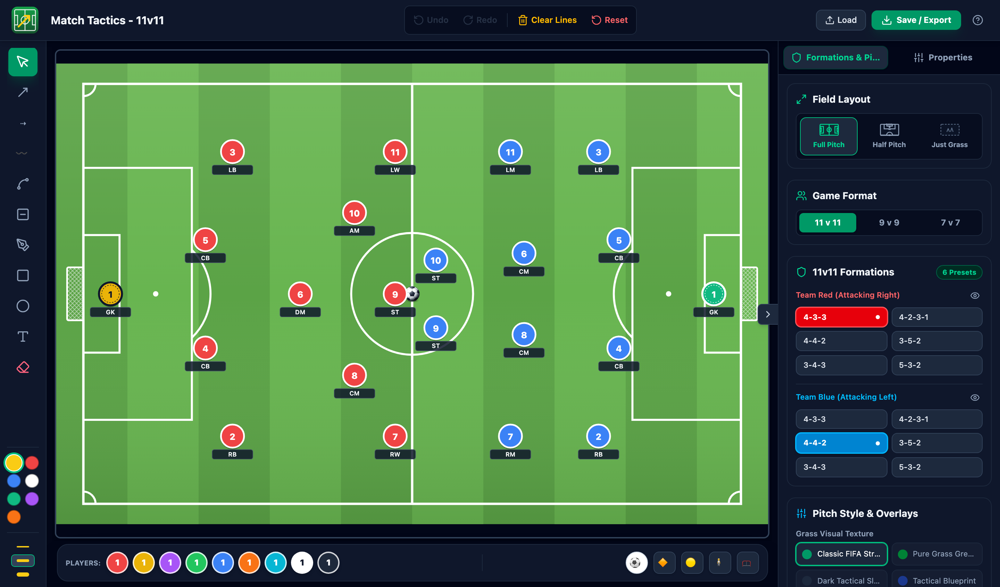

# ⚽ Tactical Soccer Board

A free tactical board for soccer coaches that runs in the browser. Set up
formations, draw runs and passes, and export the result as an image or a PDF
coaching sheet. Boards are saved in your browser; nothing is uploaded.

**Open it at [tacticalboard.app](https://tacticalboard.app/).**



## Features

- 11v11, 9v9 and 7v7, each with formation presets, plus 7v7 build-out lines.
- Full pitch, half pitch or plain grass, four pitch styles, and zone and grid
  overlays.
- Tools for runs, passes, dribbles, curved runs, screens, freehand lines,
  shaded zones and text. Anything can be moved or edited afterwards.
- Animated sequences: build frames, move players and the ball, bend their
  runs, and play them back. Export the animation as MP4 or MOV video.
- Export to PNG, JPEG, SVG or a PDF sheet with your coaching notes.
- Share a board as a link, with the whole board stored in the link itself.
- Create drills with AI (experimental): copy a prompt from
  [tacticalboard.app/ai](https://tacticalboard.app/ai/) into an AI assistant,
  describe a drill, and paste the answer into the board.
- Undo and redo, automatic saving, and saving or opening `.tacticalboard`
  project files.

Feedback is welcome in
[issues](https://github.com/tamsler/tactical-board/issues).

See the [CHANGELOG](CHANGELOG.md) for what changed in each version.

## Development

Requires [Node.js](https://nodejs.org/) 20.19+ or 22.12+.

```bash
git clone https://github.com/tamsler/tactical-board.git
cd tactical-board
npm install
npm run dev
```

| Command | What it does |
|---|---|
| `npm run dev` | Start the dev server |
| `npm run build` | Type-check and build to `dist/` |
| `npm run preview` | Serve the production build |
| `npm test` | Run the tests once (`npm run test:watch` to watch) |
| `npm run lint` | Lint with [Oxlint](https://oxc.rs/docs/guide/usage/linter/rules) |

**Built with** React 19, TypeScript, Vite and Tailwind CSS v4. Images are
drawn with the browser's Canvas API, PDFs use jsPDF, video uses Mediabunny,
and tests use Vitest with Testing Library.

### Specs

- [docs/specs/core-board.md](docs/specs/core-board.md): the board, tools,
  formations and exports, with acceptance criteria.
- [docs/specs/animation.md](docs/specs/animation.md): animation, playback,
  sharing, files and video export.
- [docs/agent/document-format.md](docs/agent/document-format.md): the
  `.tacticalboard` file format, written for AI agents. `npm run check:board
  -- <file>` validates a file; `npm run build:ai` regenerates the prompt and
  examples served at `/ai/`.

When you change behaviour, update the relevant spec and add a CHANGELOG entry
under **Unreleased**.

## Contact

Thomas Amsler, [info@tacticalboard.app](mailto:info@tacticalboard.app). Bugs
and ideas go in [GitHub issues](https://github.com/tamsler/tactical-board/issues).

## License

[MIT](LICENSE)
